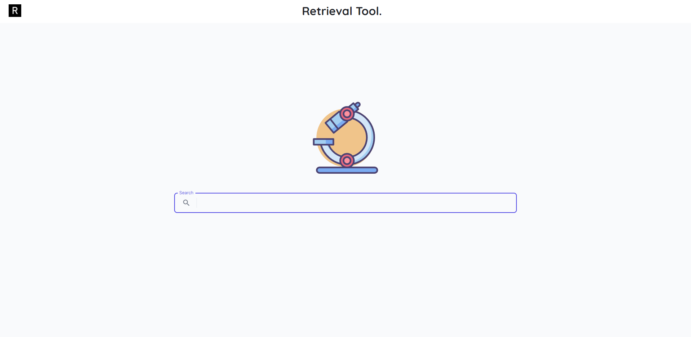

# Scientific-Articles-Retrieval-Tool
<p align="center"></p>

### Data&model
> [Click here](https://universityofadelaide.app.box.com/folder/147443411383)

### Instruction
> **Scripts**  
  

> **Box Data**  
  

### Front-end
```shell
# install dependence
yarn
# development
yarn dev
# build
yarn build
# run
yarn start
```
> yarn latest required

### Back-end
```shell
# install dependence
pip install -r requirements.txt
# run
python app.py
```
> python3.6+ required
